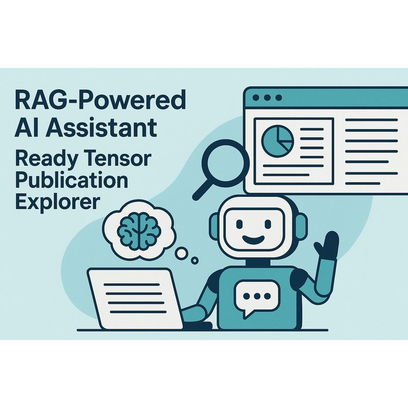

# Agentic AI Developer Certification Project: A RAG-based AI assistant for Tensor Publication Explorer



### Tags : AAIDC2025, Agentic AI, Certification Program, Chain-of-Thought, Document Assistent, LangChain, Question-Answering (QA), Retrieval-Augmented Generation (RAG), ReAct, Vector Databases
### Co-Authors: chibueze.k.muoneke@gmail.com, nyajuaya.j.a@gmail.com 
### Models : [Github](https://github.com/Joshua-Abok/rag_apk)
### Dataset: [project_1_publications.json](https://drive.google.com/drive/folders/1HAqLXL2W-sh8hqoBb1iSauJ_0wZVRxB9)


## TL;DR:
The Ready Tensor Publication Explorer is an advanced AI-powered tool that utilizes Retrieval-Augmented Generation (RAG) techniques to automate the handling of a sample dataset that contains Ready Tensor technical documentation. By leveraging RAG models, the system delivers accurate and context-aware responses to (natural language) user queries. Integrating OpenAI embeddings, semantic search capabilities, and a user-friendly interface, this tools offers a scalable and efficient solution for Ready Tensor users, developers, researchers, and organizations searching streamlined access to documentation resources enclosed in the Ready Tensor platform by exploring its contents and asking questions. 

 
## Tool Overview 
A LangChain-based pipeline that connects:
- Prompt formulation
- Vector store retrieval Chroma
- Large Language Models (LLM)-generated response
- Document ingestion into the vector store
- Basic UX for interaction (minimal UI)  
- Run a few example queries to test retrieval and response quality
- Session-based memory or (AND?) intermediate reasoning steps (ReAct)


## Features
• _Automated Documentation ReadyTensor_: Extracts and processes documentation from a sample dataset while maintaining structural integrity.  
• _Vector Database Storage_: Uses Chroma as a scalable and optimized backend for storing embeddings and document metadata.  
• _Semantic Search with OpenAI Embeddings_: Enables intelligent, context-aware lookup of relevant documentation sections, significantly improving search efficiency.  
• _RAG-based Q&A System_: Employs RAG to provide precise and contextually accurate answers to user queries.  
• _Minimal UI_: Offers an interactive and intuitive querying experience, making documentation searches easy for users.  
• _Fast and Scalable Processing_: Efficient indexing and retrieval mechanisms allow for quick searches across large documentation datasets.  


## Installation Instructions
This pubblication has a GitHub code repository attached under the "Models" ("Codes") section. We recommend reading through the pubblication first to understand the concepts, then to see how the code repository implements these ideas in practice.
1. Clone the repository
   ```bash
   git clone https://github.com/<your-org>/<your-repo>.git
   cd <your-repo>
   git checkout dev
   ```   
2. Create and activate a virtual environment:
   ```bash
   python3 -m venv .venv
   source .venv/bin/activate       # Linux / macOS
   .\.venv\Scripts\activate      # Windows
   ```
3. Set your environment variables:
   ```
   OPEN_API_KEY=your_open_api_key_here  
   ```
4. Install dependencies:
   ```bash
   pip install -r requirements.txt
   ```
5. Run locally the tool on the [sample dataset of the ReadyTensor publications](https://drive.google.com/drive/folders/1HAqLXL2W-sh8hqoBb1iSauJ_0wZVRxB9).  
    _Note_ The sample dataset is available also under the "Models" section of the publication.  


## Usage Examples   
The assistant (this tool?) is built to help users explore and understand publications in TensorFlow. Below are several usage examples of the RAG-powered AI assistant for a  Tensor Publication Explorer and their code snippet and output are available in the GitHub repository.  
- _Get summaries of a paper or topic_  : e.g. What’s this publication about?   
- _Chat with a specific paper_         : e.g. What models or tools were used?, Any limitations or assumptions?

Here are some realistic use-case examples of the RAG-powered AI Assistant to explore Tensor publications, broken down by specific fields like Academia and Development.
- _Use Cases in Ready Tensor_ : Summaries of a paper or topic, Chat with a specific paper.
- _Use Cases in Academia_ : Literature Review Automation, Semantic Paper Search for Proposal Writing.
- _Use Cases for Developers / Engineers_ :  Code Example Extraction, Model Comparison for System Design.
- _Use in Institutions or Enterprises_ : Knowledge Management, Research Assistant for Scientific Editors.


## API Documentation
API keys are stored securely in environment variables (for secure access). The API exposes endpoints for querying and interacting with Ready Tensor publications using the RAG pipeline.

**Example Endpoints:**
- `/query` — Submit a publication-related question for Q&A response
- `/summarize` — Retrieve a publication summary
- `/search` — Perform a semantic search on the dataset

_All endpoints require authentication using your `OPEN_API_KEY`._


## References
- [LangChain](https://www.langchain.com/langchain)    
- [project_1_publications.json](https://drive.google.com/drive/folders/1HAqLXL2W-sh8hqoBb1iSauJ_0wZVRxB9)    
- [GitHub repository](https://github.com/Joshua-Abok/rag_apk)               
- [Openai API](https://platform.openai.com/account/api-keys)                 
- [Ready Tensor Certifications](https://app.readytensor.ai/hubs/ready_tensor_certifications)
- [AAIDC Module 1 Project: Foundations of Agentic AI – Your First RAG Assistant](https://app.readytensor.ai/publications/aaidc-module-1-project-foundations-of-agentic-ai-your-first-rag-assistant-4n07ViGCey0l)
- [Project 1 Submission Guidelines - Agentic AI Developer Certification (AAIDC-Week3)](https://app.readytensor.ai/publications/project-1-submission-guidelines-agentic-ai-developer-certification-aaidc-week3-BblNcQTBi5Os)  
- [Technical Evaluation Rubric](https://app.readytensor.ai/publications/WsaE5uxLBqnH)
- [Engage and Inspire: Best Practices for Publishing on Ready Tensor](https://app.readytensor.ai/publications/engage_and_inspire_best_practices_for_publishing_on_ready_tensor_SBgkOyUsP8qQ)
- [Markdown for Machine Learning Projects: A Comprehensive Guide](https://app.readytensor.ai/publications/markdown_for_machine_learning_projects_a_comprehensive_guide_LX9cbIx7mQs9)
- [The Open Source Repository Guide: Best Practices for Sharing Your AI/ML and Data Science Projects](https://app.readytensor.ai/publications/best-practices-for-ai-project-code-repositories-0llldKKtn8Xb)


## Contributing
We welcome contributions to improve the Ready Tensor Publication Explorer!

1. **Fork** the [GitHub repository](https://github.com/Joshua-Abok/rag_apk)
2. **Create a feature branch:**
   ```bash
   git checkout -b your-feature-name
   ```
3. **Commit and push your changes.**
4. **Submit a Pull Request** and describe your contribution.

Please follow our code style and guidelines. For questions or suggestions, [open an issue](https://github.com/Joshua-Abok/rag_apk/issues).


## License
This publication is licensed under the [MIT License](LICENSE).


## Contact
chibueze.k.muoneke@gmail.com, michelaagostini73@gmail.com, nyajuaya.j.a@gmail.com 


## Acknowledgments
This project is part of the **Agentic AI Developer Certification**  program by the [Ready Tensor](https://www.readytensor.ai). We appreciate the contributions of the Ready Tensor developers in providing the sample Ready Tensor dataset, the guidelines /documentation and RAG framework. Their work has been valuable in building an effective and scalable solution for the AI-powered LLM-RAG Ready Tensor Publication Explorer.

