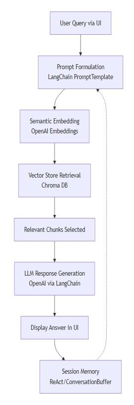

# Agentic AI Developer Certification Project: A RAG-based AI assistant for Tensor Publication Explorer
# Agentic AI Developer Certification Project: RAG-Powered Ready Tensor Publication Explorer
# Agentic AI Developer Certification Project: A RAG AI Assistant for Exploring Ready Tensor Publications


### Tags : AAIDC2025, Agentic AI, Certification Program, Chain-of-Thought, Document Assistent, LangChain, Question-Answering (QA), Retrieval-Augmented Generation (RAG), ReAct, Vector Databases
### Co-Authors: chibueze.k.muoneke@gmail.com, nyajuaya.j.a@gmail.com 
### Models : [Github](https://github.com/Joshua-Abok/rag_apk)
### Dataset: [project_1_publications.json](https://drive.google.com/drive/folders/1HAqLXL2W-sh8hqoBb1iSauJ_0wZVRxB9)


## TL;DR:
The Ready Tensor Publication Explorer is an advanced AI-powered tool that utilizes Retrieval-Augmented Generation (RAG) techniques to automate the handling of a sample dataset that contains Ready Tensor technical documentation. By leveraging RAG models, the system delivers accurate and context-aware responses to (natural language) user queries. Integrating OpenAI embeddings, semantic search capabilities, and a user-friendly interface, this tools offers a scalable and efficient solution for Ready Tensor users, developers, researchers, and organizations searching streamlined access to documentation resources enclosed in the Ready Tensor platform by exploring its contents and asking questions.   
(Ready Tensor Publication Explorer is an AI-powered tool leveraging Retrieval-Augmented Generation (RAG) to automate querying, summarization, and exploration of Ready Tensor scientific publications. Built with LangChain, Chroma, and OpenAI LLMs, it enables advanced semantic search and question answering on publication datasets.)


## Tool Overview
This project uses a sample dataset and is structured on a modular LangChain-based pipeline.

### Sample dataset
The sammple dataset is a dataset of a sample of publications from the Ready Tensor platform. It details, it does contain 35 publications, 
each of them characterised by the following 5 variables: id, username, license, title, publication description. Among the 35 publications, 27 
publications have licenses of type "CC Licence" and "Mit Licence" (23 and 4, respectively). Therefore, 8 publications have license 
none or missing (5 and 3, respectively). Under these licenses, since the author has granted permission for reuse, the publications can be used 
for open source projects. 

### Overview & Architecture
This project presents a LangChain-based pipeline designed to:

- Generate and process user prompts.
- Retrieve relevant content using Chroma (vector store).
- Leverage Large Language Models (LLMs) for context-aware responses.
- Ingest and index documentation into the vector database.
- Offer a basic, user-friendly interface for interaction. (Basic UX for interaction (minimal UI)??)
- Support session-based memory and intermediate reasoning (ReAct paradigm?).
- Enable example queries for quality validation.


## Overview & Architecture
This project is structured on a modular LangChain-based pipeline. Below, each feature is mapped to the specific tool or module implementing it:

| **Feature**                                     | **Tool / Library / Module**                           |
|-------------------------------------------------|-------------------------------------------------------|
| Prompt formulation                              | LangChain PromptTemplate                              |
| Vector store retrieval                          | Chroma Vector Database                                |
| LLM-generated response                          | OpenAI GPT-3.5/4 via LangChain                        |
| Document ingestion & embedding                  | LangChain DocumentLoader + OpenAI Embeddings + Chroma |
| Minimal UI for interaction                      | Streamlit (or Flask/FastAPI, as implemented)          |
| Example queries, retrieval, response quality    | LangChain Chains & Evaluators                         |
| Session-based memory/intermediate reasoning     | LangChain ReAct, ConversationBuffer                   |


### Application Workflow
Below is a flowchart illustrating the core workflow and system architecture of the application:  




## Features
- **Automated Documentation Ingestion:** Efficiently extracts and processes Ready Tensor documentation while preserving structure.
- **Vector Database Storage (Chroma):** Optimized backend for storing embeddings and metadata, ensuring fast and reliable retrieval.
- **Semantic Search with OpenAI Embeddings:** Provides intelligent, context-aware lookup for relevant documentation sections.
- **RAG-Based Q&A System:** Delivers precise and contextually rich answers to user queries about publications.
- **Minimal UI:** Simple, interactive interface for easy exploration.
- **Scalable and Fast:** Designed to handle large datasets with quick indexing and retrieval.


## Installation Instructions
This pubblication has a GitHub code repository attached under the "Code" section. We recommend reading through the pubblication first to understand the concepts, then to see how the code repository implements these ideas in practice.

> **Prerequisites:** Python 3.10+, pip, and access to the referenced dataset.

1. **Clone the repository:**
   ```bash
   git clone https://github.com/<your-org>/<your-repo>.git
   cd <your-repo>
   git checkout dev
   ```

2. **Create and activate a virtual environment:**
   ```bash
   python3 -m venv .venv
   source .venv/bin/activate        # For Linux / macOS
   .\.venv\Scripts\activate         # For Windows
   ```

3. **Set your environment variables:**
   ```bash
   export OPEN_API_KEY=your_open_api_key_here    # For Linux / macOS
   set OPEN_API_KEY=your_open_api_key_here       # For Windows
   ```

4. **Install dependencies:**
   ```bash
   pip install -r requirements.txt
   ```

5. **Run the tool locally using the [sample dataset](https://drive.google.com/drive/folders/1HAqLXL2W-sh8hqoBb1iSauJ_0wZVRxB9).**
   > _Note:_ The dataset is also linked in the "Datasets" section above.  
    > _Note:_ The sammple dataset is a dataset of a sample of publications from the Ready Tensor platform. It details, it does contain 35 publications, 
each of them characterised by the following 5 variables: id, username, license, title, publication description. Among the 35 publications, 27 
publications have licenses of type "CC Licence" and "Mit Licence" (23 and 4, respectively). Therefore, 8 publications have license 
none or missing (5 and 3, respectively). Under these licenses, since the author has granted permission for reuse, the publications can be used 
for open source projects.   

## Usage Examples
The assistant helps users explore and comprehend Tensor publications.(Below are several usage examples of the RAG-powered AI assistant for Exploring Ready Tensor Publications and their code snippet and output are available in the GitHub repository.????)  

### General Queries
- **Get a summary:**  
  _"What is this publication about?"_
- **Extract details from a paper:**  
  _"What models or tools were used in this publication?"_
- **Discuss limitations:**  
  _"Are there any assumptions or limitations mentioned in this work?"_

### Use Cases
- **For Ready Tensor Users:**  
  - Summarize papers or topics
  - Chat interactively with publication content
- **In Academia:**  
  - Automate literature reviews
  - Semantic search for proposal writing
- **For Developers/Engineers:**  
  - Extract code examples
  - Compare models for system design
- **In Enterprises/Institutions:**  
  - Knowledge management support
  - Research assistant for scientific editors


## API Documentation
API keys are stored securely in environment variables (for secure access). The API exposes endpoints for querying and interacting with Ready Tensor publications using the RAG pipeline.

**Example Endpoints:**
- `/query` — Submit a publication-related question for Q&A response
- `/summarize` — Retrieve a publication summary
- `/search` — Perform a semantic search on the dataset

_All endpoints require authentication using your `OPEN_API_KEY`._


## References
- [LangChain](https://www.langchain.com/langchain)    
- [project_1_publications.json](https://drive.google.com/drive/folders/1HAqLXL2W-sh8hqoBb1iSauJ_0wZVRxB9)    
- [GitHub repository](https://github.com/Joshua-Abok/rag_apk)               
- [Openai API](https://platform.openai.com/account/api-keys)                 
- [Ready Tensor Certifications](https://app.readytensor.ai/hubs/ready_tensor_certifications)
- [AAIDC Module 1 Project: Foundations of Agentic AI – Your First RAG Assistant](https://app.readytensor.ai/publications/aaidc-module-1-project-foundations-of-agentic-ai-your-first-rag-assistant-4n07ViGCey0l)
- [Project 1 Submission Guidelines - Agentic AI Developer Certification (AAIDC-Week3)](https://app.readytensor.ai/publications/project-1-submission-guidelines-agentic-ai-developer-certification-aaidc-week3-BblNcQTBi5Os)  
- [Technical Evaluation Rubric](https://app.readytensor.ai/publications/WsaE5uxLBqnH)
- [Engage and Inspire: Best Practices for Publishing on Ready Tensor](https://app.readytensor.ai/publications/engage_and_inspire_best_practices_for_publishing_on_ready_tensor_SBgkOyUsP8qQ)
- [Markdown for Machine Learning Projects: A Comprehensive Guide](https://app.readytensor.ai/publications/markdown_for_machine_learning_projects_a_comprehensive_guide_LX9cbIx7mQs9)
- [The Open Source Repository Guide: Best Practices for Sharing Your AI/ML and Data Science Projects](https://app.readytensor.ai/publications/best-practices-for-ai-project-code-repositories-0llldKKtn8Xb)


## Contributing
We welcome contributions to improve the Ready Tensor Publication Explorer!

1. **Fork** the [GitHub repository](https://github.com/Joshua-Abok/rag_apk)
2. **Create a feature branch:**
   ```bash
   git checkout -b your-feature-name
   ```
3. **Commit and push your changes.**
4. **Submit a Pull Request** and describe your contribution.

Please follow our code style and guidelines. For questions or suggestions, [open an issue](https://github.com/Joshua-Abok/rag_apk/issues).

### Future Implementations
We are actively seeking contributors who want to help implement and/or propose the following future features:

- **Advanced UI/UX:** Develop a more intuitive and visually appealing web interface.
- **Expanded Dataset Support:** Enable ingestion of additional publication formats and sources.
- **Multi-Language Support:** Integrate multilingual document processing and querying.
- **Fine-tuned LLM Models:** Incorporate domain-specific or fine-tuned LLMs for improved accuracy.
- **User Authentication & Profiles:** Add user management, history tracking, and personalization.
- **Integration with Ready Tensor Platform:** Seamlessly connect with Ready Tensor’s broader ecosystem and APIs.
- **Export & Reporting:** Allow users to export summaries or Q&A sessions in various formats (PDF, CSV, etc).
- **Feedback & Rating System:** Let users rate answers to improve system performance.

Feel free to suggest more ideas by opening an issue or starting a discussion!  For bug reports or feature requests, [open an issue](https://github.com/Joshua-Abok/rag_apk/issues).For general questions or new ideas, start a [discussion](LINK TO BE ENCLOSED).


## License
This publication is licensed under the [MIT License](LICENSE).


## Contact
chibueze.k.muoneke@gmail.com, michelaagostini73@gmail.com, nyajuaya.j.a@gmail.com 


## Acknowledgments
This project is part of the **Agentic AI Developer Certification**  program by the [Ready Tensor](https://www.readytensor.ai). We appreciate the contributions of the Ready Tensor developers in providing the sample Ready Tensor dataset, the guidelines /documentation and RAG framework. Their work has been valuable in building an effective and scalable solution for the AI-powered LLM-RAG Ready Tensor Publication Explorer.    
(Special thanks to the Ready Tensor developer community for their guidance and contributions.)

