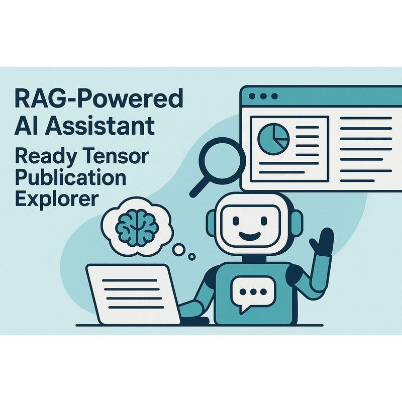

# Agentic AI Developer Certification: Course Project: Build the RAG-Powered AI Assistant Ready Tensor Publication Explorer  



### Tags : AAIDC2025, Agentic AI, Certification Program, Chain-of-Thought, Document Assistent, LangChain, Memory(?), Prompt Engineering, Question-Answering, Retrieval-Augmented Generation (RAG), ReAct, Vector Databases (LLMs?)
### Co-Authors: chibueze.k.muoneke@gmail.com TO BE ENCLOSED Joshua N
### Models : [Github](https://githup_project)  TO BE ENCLOSED THE FINAL GitHub
### Dataset: [project_1_publications.json](https://drive.google.com/drive/folders/1HAqLXL2W-sh8hqoBb1iSauJ_0wZVRxB9)


## TL;DR:
This study presents a structured approach using LangChain to develop an AI-powered Ready Tensor Publication Explorer. This system is designed to process user inputs, execute predefined actions, and provide context-aware, informed responses.  
This study explores the use of a Retrieval-Augmented Generation (RAG) Agent, which combines retrieval and generation functions within a unified framework to improve response accuracy and relevance.  This study investigates how to build a simple RAG-powered assistant, the Ready Tensor Publication Explorer, that answers questions based on a custom document set. Build a conversational assistant that helps users explore the contents of Ready Tensor publications by asking natural language questions.

Ready Tensor Publication Explorer & Retrieval-Augmented Generation (RAG) Agent is an advanced AI-powered tool designed to automate the process of Ready Tensor technical documentation (pubblications), storing relevant content in a vector database, and enabling intelligent retrieval and question-answering. (Built with Pydantic AI and Supabase??), this system provides a scalable and efficient solution for developers, researchers, Ready Tensor users and organizations exploring the contents of Ready Tensor publications by asking natural language questions (seeking streamlined access to documentation resources (pubblications enclosed in the platform)).
By leveraging RAG models, the system ensures accurate and contextually relevant responses to user queries. The combination of (OpenAI ?) embeddings, semantic search, and a user-friendly interface makes this tool a powerful addition to AI-driven documentation search and retrieval solutions.

The LLM-RAG Ready Tensor Publication Explorer is an open-source tool designed to efficiently extract data from a sample ReadyTensor (document) dataset and answer questions using retrieval-augmented generation (RAG) techniques powered by large language models (LLMs).


## Tool Overview 
• A LangChain-based pipeline that includes: Prompt formulation, Vector store retrieval (e.g., 
FAISS, Chroma), Response generation from an LLM   
• Optional enhancements: Basic memory components (e.g., session memory), Intermediate 
reasoning using ReAct or CoT-style steps   
• Evaluation loop or basic logging for QA   
• Basic UX (CLI, notebook, or minimal UI)   

 Setup Overview
RAG (Retrieval-Augmented Generation) is used to augment LLM answers with data from a scientific paper corpus.  
LangChain is the orchestration layer to manage:  
   - Document loading  
   - Embedding and indexing  
   - Retrieval  
   - Prompting and LLM responses  


## Features (to be changed)
• _Automated Documentation ReadyTensor_: Extracts and processes documentation from various sources(?) while maintaining structural integrity.  
• _Vector Database Storage_: Uses Chroma (or FAISS?) as a scalable and optimized backend for storing embeddings and document metadata.  
• _Semantic Search with OpenAI Embeddings_: Enables intelligent, context-aware lookup of relevant documentation sections, significantly improving search efficiency.  
• _RAG-based Q&A System_: Employs Retrieval-Augmented Generation to provide precise and contextually accurate answers to user queries.  
• _Preserves Code Blocks & Formatting_: Ensures that retrieved documentation retains its original structure, including syntax highlighting and paragraph integrity.  
• _Modern UI with ?_: Offers an interactive and intuitive querying experience, making documentation searches seamless for users.  
• _Fast and Scalable Processing_: Efficient indexing and retrieval mechanisms allow for quick searches across large documentation sets.  
• _Continuous Updates_: Automatically refreshes stored documentation at regular intervals to keep information up-to-date.  


## Installation Instructions
1. Clone this repository
   ```bash
   git clone https://github.com/......
   or cd intelligent-file-task-automation
   ```
2. Create and activate a virtual environment:
   ```bash
   python -m venv venv
   source venv/bin/activate
   ```
3. Set your environment variables:
   ```
   OPEN_API_KEY=your_open_api_key_here ??
   GROQ_API_KEY=your_groq_api_key_here ??
   ```
8. Install dependencies:
   ```bash
   pip install -r requirements.txt
   ```
9. Run locally:
   ```bash
   python app.py  (??)
   ```
10. Run the tool on the [sample dataset of the ReadyTensor publications](https://drive.google.com/drive/folders/1HAqLXL2W-sh8hqoBb1iSauJ_0wZVRxB9).


## Usage Examples 
This tool is ideal for document summarization, academic research, and more.
Below are several usage examples of a RAG-powered AI assistant for a "Tensor Publication Explorer" using LangChain. The assistant is built to help users explore and understand scientific publications in TensorFlow.
- _Get summaries of a paper or topic_  Eventually enclose the snippet code and output 
- _Chat with a specific paper_         Eventually enclose the snippet code and output 
- 
Here are some realistic use-case examples of a RAG-powered AI Assistant using LangChain to explore Tensor publications, broken down by specific fields like Academia and Development.
- _Use Cases in Ready Tensor_ : 
- _Use Cases in Academia_ : Literature Review Automation, Semantic Paper Search for Proposal Writing
- _Use Cases for Developers / Engineers_ :  Code Example Extraction, Model Comparison for System Design,
- _Use in Institutions or Enterprises_ : Knowledge Management, Research Assistant for Scientific Editors

## API Documentation
API keys stored in environment variables for secure access.
Model used ? 

## References
- [LangChain](https://www.langchain.com/langchain)    
- [project_1_publications.json](https://drive.google.com/drive/folders/1HAqLXL2W-sh8hqoBb1iSauJ_0wZVRxB9)    
- [GitHub repository](https://github.com/project)
- [Openai API](https://platform.openai.com/account/api-keys)    TO BE VERIFIED                 
- [Groq API](https://console.groq.com/) TO BE VERIFIED
- [Technical Evaluation Rubric](https://app.readytensor.ai/publications/WsaE5uxLBqnH)
- [Engage and Inspire: Best Practices for Publishing on Ready Tensor](https://app.readytensor.ai/publications/engage_and_inspire_best_practices_for_publishing_on_ready_tensor_SBgkOyUsP8qQ)
- [Markdown for Machine Learning Projects: A Comprehensive Guide](https://app.readytensor.ai/publications/markdown_for_machine_learning_projects_a_comprehensive_guide_LX9cbIx7mQs9)
  
- [The Open Source Repository Guide: Best Practices for Sharing Your AI/ML and Data Science Projects](https://app.readytensor.ai/publications/best-practices-for-ai-project-code-repositories-0llldKKtn8Xb)


## Contributing
We welcome contributions to improve the Ready Tensor Publication Explorer. Follow guidelines on how to contribute to the project:

1. Fork the repository [GitHub repository](https://github.com/project)
   
2. Create a new branch:
   ```bash
   git checkout -b feature-xyz
   ```

## License

MIT licence ?  

## Contact

Your contact information.

## Acknowledgments

Acknowledgments for contributors or similar.


